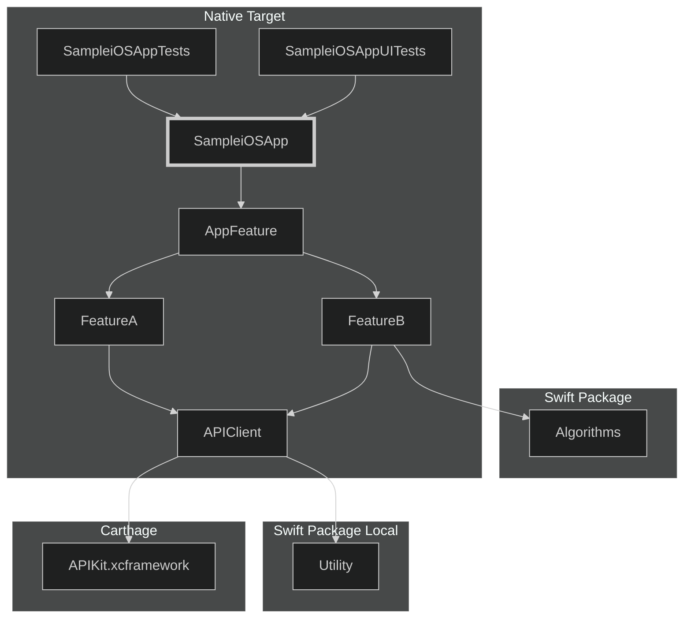

```mermaid
%%{init: {'theme':'dark'}}%%
flowchart TD
style SampleiOSApp stroke-width:4px
subgraph Swift Package
Algorithms["Algorithms"]
end
subgraph Swift Package Local
Utility["Utility"]
end
subgraph Carthage
APIKit.xcframework["APIKit.xcframework"]
end
subgraph Native Target
APIClient["APIClient"]
AppFeature["AppFeature"]
FeatureA["FeatureA"]
FeatureB["FeatureB"]
SampleiOSApp["SampleiOSApp"]
SampleiOSAppTests["SampleiOSAppTests"]
SampleiOSAppUITests["SampleiOSAppUITests"]
end
APIClient --> Utility
APIClient --> APIKit.xcframework
AppFeature --> FeatureA
AppFeature --> FeatureB
FeatureA --> APIClient
FeatureB --> APIClient
FeatureB --> Algorithms
SampleiOSApp --> AppFeature
SampleiOSAppTests --> SampleiOSApp
SampleiOSAppUITests --> SampleiOSApp
```
